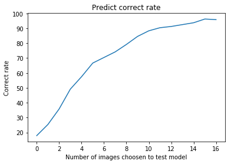

# 基于GEI的HOG特征，使用SVM分类器分类步态识别

采用中科院自动化所GaitDatasetA-silh小型步态识别数据集进行实验分析

将数据集每人序列帧图像平均分为两部分，一部分为训练集，一部分为测试集

对行人二值化序列帧图像求平均得到GEI步态能量图，再采用OpenCV内置HOGDescriptor提取出GEI的HOG特征值，利用HOG特征训练SVM分类器，最终采用模型进行预测。


```python
import cv2 as cv
from matplotlib import pyplot as plt
import numpy as np
import os
%matplotlib inline


def cut_img(img, T_H, T_W):
    # 获得最高点和最低点
    y = img.sum(axis=1)
    y_top = (y != 0).argmax(axis=0)
    y_btm = (y != 0).cumsum(axis=0).argmax(axis=0)
    img = img[y_top:y_btm + 1, :]
    # 如果高比宽要大，用高计算 resize 的比例
    _r = img.shape[1] / img.shape[0]
    _t_w = int(T_H * _r)
    img = cv.resize(img, (_t_w, T_H), interpolation=cv.INTER_CUBIC)
    # 获得人的对称轴
    sum_point = img.sum()
    sum_column = img.sum(axis=0).cumsum()
    x_center = -1
    for i in range(sum_column.size):
        if sum_column[i] > sum_point / 2:
            x_center = i
            break
    h_T_W = int(T_W / 2)
    left = x_center - h_T_W
    right = x_center + h_T_W
    if left <= 0 or right >= img.shape[1]:
        left += h_T_W
        right += h_T_W
        _ = np.zeros((img.shape[0], h_T_W))
        img = np.concatenate([_, img, _], axis=1)
    img = img[:, left:right]
    return img
```

## 图片预处理
对人体区域进行裁剪，将人体对称轴放于图片中央。

# GEI步态能量图


```python
def get_GEI(imgs):
    GEI = (imgs[0]/255).astype("uint8")
    for img in imgs[1:]:
        GEI += (img/255).astype("uint8")
    GEI = GEI/len(imgs)

    return (GEI*255).astype("uint8")
```

# 取HOG特征
采用opencv封装的HOGDescriptor进行HOG特征计算

block大小为8 * 8
cell大小为8 * 8
每个block 取 9 个 bin


```python
SZ=20
bin_n = 16 # Number of bins
affine_flags = cv.WARP_INVERSE_MAP|cv.INTER_LINEAR
def get_Hog(img):
    winSize = (img.shape[1], img.shape[0])      # winSize = (64,64)
    blockSize = (8,8)                               # blockSize = (16,16)
    blockStride = (8,8)
    cellSize = (8,8)
    nbins = 9
    derivAperture = 1
    winSigma = 4.
    histogramNormType = 0
    L2HysThreshold = 2.0000000000000001e-01
    gammaCorrection = 0
    nlevels = 64
    hog = cv.HOGDescriptor(winSize,blockSize,blockStride,
                  cellSize,nbins,derivAperture,
                  winSigma,histogramNormType,L2HysThreshold,
                  gammaCorrection,nlevels)
    #compute(img[, winStride[, padding[, locations]]]) -> descriptors
    winStride = (8,8)
    padding = (8,8)
    locations = [] # (10, 10)# ((10,20),)
    hist = hog.compute(img,winStride,padding,locations)
    # hist.dtype = np.float64
    return hist
```

# 读取GaitDatasetA-silh数据集文件


```python
roots = "/home/aistudio/GaitDatasetA-silh/"
cells = []
labels = []
label = os.listdir(roots)
print(label)
# print(label)
for dir_ in label:
    dirs = os.listdir(roots + dir_)
    for dir__ in dirs:
        # print(dir_ + "_" + dir__)
        for root_,dirs_,files in os.walk(roots + dir_ + "/" + dir__):
            # print(root_)
            imgs = []
            for file in files:
                srcImg = cv.imread(root_ + "/" + file,0)
                imgs.append(cut_img(srcImg,128,128))
            cells.append(imgs)
        labels.append(dir_ + "_" + dir__)
print(labels)
```

    ['fyc', 'xxj', 'ml', 'zdx', 'lsl', 'wl', 'zyf', 'rj', 'wq', 'lqf', 'zc', 'ljg', 'zjg', 'yjf', 'xch', 'zl', 'syj', 'hy', 'nhz', 'wyc']
    ['fyc_00_3', 'fyc_90_4', 'fyc_00_2', 'fyc_90_3', 'fyc_45_1', 'fyc_45_4', 'fyc_00_4', 'fyc_00_1', 'fyc_45_3', 'fyc_90_2', 'fyc_45_2', 'fyc_90_1', 'xxj_00_3', 'xxj_90_4', 'xxj_00_2', 'xxj_90_3', 'xxj_45_1', 'xxj_45_4', 'xxj_00_4', 'xxj_00_1', 'xxj_45_3', 'xxj_90_2', 'xxj_45_2', 'xxj_90_1', 'ml_00_3', 'ml_90_4', 'ml_00_2', 'ml_90_3', 'ml_45_1', 'ml_45_4', 'ml_00_4', 'ml_00_1', 'ml_45_3', 'ml_90_2', 'ml_45_2', 'ml_90_1', 'zdx_00_3', 'zdx_90_4', 'zdx_00_2', 'zdx_90_3', 'zdx_45_1', 'zdx_45_4', 'zdx_00_4', 'zdx_00_1', 'zdx_45_3', 'zdx_90_2', 'zdx_45_2', 'zdx_90_1', 'lsl_00_3', 'lsl_90_4', 'lsl_00_2', 'lsl_90_3', 'lsl_45_1', 'lsl_45_4', 'lsl_00_4', 'lsl_00_1', 'lsl_45_3', 'lsl_90_2', 'lsl_45_2', 'lsl_90_1', 'wl_00_3', 'wl_90_4', 'wl_00_2', 'wl_90_3', 'wl_45_1', 'wl_45_4', 'wl_00_4', 'wl_00_1', 'wl_45_3', 'wl_90_2', 'wl_45_2', 'wl_90_1', 'zyf_00_3', 'zyf_90_4', 'zyf_00_2', 'zyf_90_3', 'zyf_45_1', 'zyf_45_4', 'zyf_00_4', 'zyf_00_1', 'zyf_45_3', 'zyf_90_2', 'zyf_45_2', 'zyf_90_1', 'rj_00_3', 'rj_90_4', 'rj_00_2', 'rj_90_3', 'rj_45_1', 'rj_45_4', 'rj_00_4', 'rj_00_1', 'rj_45_3', 'rj_90_2', 'rj_45_2', 'rj_90_1', 'wq_00_3', 'wq_90_4', 'wq_00_2', 'wq_90_3', 'wq_45_1', 'wq_45_4', 'wq_00_4', 'wq_00_1', 'wq_45_3', 'wq_90_2', 'wq_45_2', 'wq_90_1', 'lqf_00_3', 'lqf_90_4', 'lqf_00_2', 'lqf_90_3', 'lqf_45_1', 'lqf_45_4', 'lqf_00_4', 'lqf_00_1', 'lqf_45_3', 'lqf_90_2', 'lqf_45_2', 'lqf_90_1', 'zc_00_3', 'zc_90_4', 'zc_00_2', 'zc_90_3', 'zc_45_1', 'zc_45_4', 'zc_00_4', 'zc_00_1', 'zc_45_3', 'zc_90_2', 'zc_45_2', 'zc_90_1', 'ljg_00_3', 'ljg_90_4', 'ljg_00_2', 'ljg_90_3', 'ljg_45_1', 'ljg_45_4', 'ljg_00_4', 'ljg_00_1', 'ljg_45_3', 'ljg_90_2', 'ljg_45_2', 'ljg_90_1', 'zjg_00_3', 'zjg_90_4', 'zjg_00_2', 'zjg_90_3', 'zjg_45_1', 'zjg_45_4', 'zjg_00_4', 'zjg_00_1', 'zjg_45_3', 'zjg_90_2', 'zjg_45_2', 'zjg_90_1', 'yjf_00_3', 'yjf_90_4', 'yjf_00_2', 'yjf_90_3', 'yjf_45_1', 'yjf_45_4', 'yjf_00_4', 'yjf_00_1', 'yjf_45_3', 'yjf_90_2', 'yjf_45_2', 'yjf_90_1', 'xch_00_3', 'xch_90_4', 'xch_00_2', 'xch_90_3', 'xch_45_1', 'xch_45_4', 'xch_00_4', 'xch_00_1', 'xch_45_3', 'xch_90_2', 'xch_45_2', 'xch_90_1', 'zl_00_3', 'zl_90_4', 'zl_00_2', 'zl_90_3', 'zl_45_1', 'zl_45_4', 'zl_00_4', 'zl_00_1', 'zl_45_3', 'zl_90_2', 'zl_45_2', 'zl_90_1', 'syj_00_3', 'syj_90_4', 'syj_00_2', 'syj_90_3', 'syj_45_1', 'syj_45_4', 'syj_00_4', 'syj_00_1', 'syj_45_3', 'syj_90_2', 'syj_45_2', 'syj_90_1', 'hy_00_3', 'hy_90_4', 'hy_00_2', 'hy_90_3', 'hy_45_1', 'hy_45_4', 'hy_00_4', 'hy_00_1', 'hy_45_3', 'hy_90_2', 'hy_45_2', 'hy_90_1', 'nhz_00_3', 'nhz_90_4', 'nhz_00_2', 'nhz_90_3', 'nhz_45_1', 'nhz_45_4', 'nhz_00_4', 'nhz_00_1', 'nhz_45_3', 'nhz_90_2', 'nhz_45_2', 'nhz_90_1', 'wyc_00_3', 'wyc_90_4', 'wyc_00_2', 'wyc_90_3', 'wyc_45_1', 'wyc_45_4', 'wyc_00_4', 'wyc_00_1', 'wyc_45_3', 'wyc_90_2', 'wyc_45_2', 'wyc_90_1']
    

# 将数据分为训练集与测试集两部分
训练集每人每方向图片数目从1到26各一组

测试集为每人数据的后8张图片


```python
minlength = len(cells[0])//2
for cell in cells:
    if minlength > len(cell)//2:
        minlength = len(cell)//2
    else:
        continue
        

train_cells = []
for cell in cells:
    train_cells.append(cell[:len(cell)//2])
    
test = []
for i in range(1,minlength):
    test_cells = []
    for cell in cells:
        test_cells.append(cell[-minlength+i:])
    test.append(test_cells)
print(len(train_cells))
print(len(test))
```

    240
    17
    

# 对训练集构建基于GEI的HOG特征
将训练集数据读入，首先提取GEI步态能量图

然后对GEI提取HOG特征，每张GEI的HOG特征为20736 * 1大小

标记240个训练数据，按照人进行编号，每个人12组数据，共20人

输出折线图横轴为HOG数据编号，共240个；纵轴为对应人员编号，共20个


```python
responses = []

traingeis = []
for train_cell in train_cells:
    traingeis.append(get_GEI(train_cell))

trainhogs = []
for traingei in traingeis:
    trainhog = get_Hog(traingei)
    trainhogs.append(trainhog)
trainData = np.float32(trainhogs).reshape(-1,20736,1)
responses = np.repeat(np.arange(20),12)[:,np.newaxis]
print(trainData.shape)
```

    (240, 20736, 1)
    

# 对测试集构建基于GEI的HOG特征

与训练集处理方式相同，每个HOG特征为20736 * 1大小


```python
def maketestData(test_cells):
    testgeis = []
    for test_cell in test_cells:
        testgeis.append(get_GEI(test_cell))
    testhogs = []
    for testgei in testgeis:
        testhog = get_Hog(testgei)
        testhogs.append(testhog)
    testData = np.float32(testhogs).reshape(-1,20736,1)
    return testData

testDatas = []
for test_cells in test:
    testDatas.append(maketestData(test_cells))
print(len(testDatas))
```

    17
    

# 采用线性内核函数训练OpenCV内置SVM分类器


```python
svm = cv.ml.SVM_create()
svm.setKernel(cv.ml.SVM_LINEAR)
svm.setType(cv.ml.SVM_C_SVC)
svm.setC(8.35)
svm.setGamma(3.58)
svm.train(trainData,cv.ml.ROW_SAMPLE,responses)
svm.save('svm_data.dat')
```

# 使用训练好的模型进行预测
分析测试集大小对模型预测准确度的影响


```python
results = []
corrects = []
def svmpredict(i):
    result = svm.predict(testDatas[len(testDatas)-i-1])[1].astype("int")
    mask = result==responses
    correct = np.count_nonzero(mask)
    results.append(result)
    corrects.append(correct*100.0/result.size)
    print(correct*100.0/result.size)

for i in range(len(test)):
    svmpredict(i)
plt.title("Predict correct rate")
plt.xlabel("Number of images choosen to test model")
plt.ylabel("Correct rate")
plt.plot(corrects)
plt.show()
```

    17.916666666666668
    25.416666666666668
    35.833333333333336
    49.166666666666664
    57.5
    66.66666666666667
    70.41666666666667
    74.16666666666667
    79.16666666666667
    84.58333333333333
    88.33333333333333
    90.41666666666667
    91.25
    92.5
    93.75
    96.25
    95.83333333333333
    




